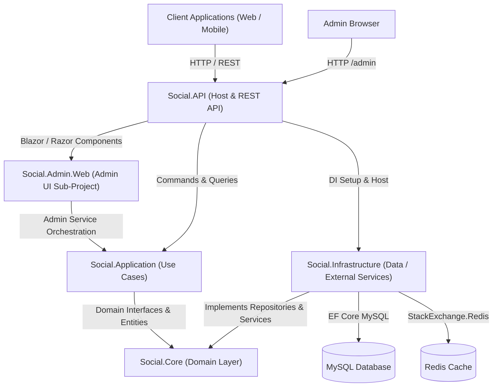

# System Architecture

## Overview
DotNetCoreSocialApi is a social platform API architected under Clean Architecture principles with CQRS (via MediatR), separating domain enterprise rules, application use cases, technical infrastructure (EF Core, Redis, Token, Email), and presentation (ASP.NET Core Controllers).

## Architecture Pattern
Clean Architecture (Hexagonal / Onion Architecture) with CQRS and Repository Pattern.

## System Diagram

## Core Components
| Component | Responsibility | Location |
|-----------|---------------|----------|
| `Social.Core` | Domain entities, enums, repository contracts, domain service interfaces | `Social.Core/` |
| `Social.Application` | CQRS commands, queries, handlers, DTOs, AutoMapper profiles, validations | `Social.Application/` |
| `Social.Infrastructure` | EF Core `ApplicationDbContext`, repositories, JWT TokenService, EmailService, Caching | `Social.Infrastructure/` |
| `Social.Admin.Web` | Blazor / Razor components, Admin Dashboard layout, models, UI services | `Social.Admin.Web/` |
| `Social.API` | REST Controllers, Middlewares, Rate Limiting, OpenAPI / Swagger, UI Host | `Social/` |
| SDK Pipeline | Contract-driven client generation (Orval TS + dart-dio) + hand-written Axios/Dio auth clients | `sdks/generator` (engine: package, orval config, mutator, scripts, sdk-assets) → `sdks/web`, `sdks/mobile` (generated trees gitignored) |

## Boundaries & Invariants
- `Social.Core` has ZERO dependencies on outer layers and ZERO dependencies on EF Core / ASP.NET runtime.
- `Social.Application` depends ONLY on `Social.Core`. Never on `Social.Infrastructure` or `Social.API`.
- `Social.Infrastructure` depends ONLY on `Social.Core`.
- `Social.API` configures DI and connects `Social.Application` with `Social.Infrastructure`.

## Security Model
- Auth: Dual-delivery JWT Bearer authentication:
  - API clients supply `Authorization: Bearer <token>` header.
  - Browser admin sessions supply `admin_token` HttpOnly cookie extracted via `JwtBearerEvents.OnMessageReceived`.
  - Dedicated `/admin/login` and `/admin/logout` routes with unauthenticated redirect from `/admin`.
- Role Authorization: Role-based policies (`AdminOnly`, `AdminOrModerator`) enforced on all admin endpoints.
- Token Invalidation: In-memory/Redis token blacklist middleware verifying both bearer headers and admin cookies.
- Secrets: Environment variables loaded via `.env` / system env.
- Input validation: Controller / command boundary checks, FluentValidation MediatR pipeline, and model validations.

